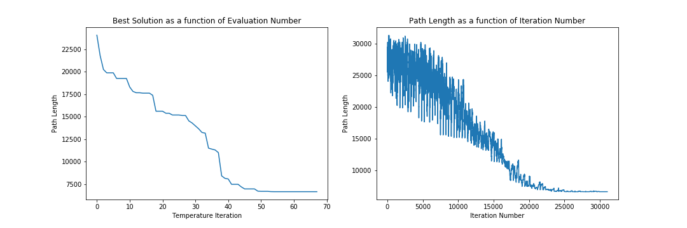

# TSP Djibouti 38

Python Version : Python 3.7  
Libraries: numpy, pandas

## How To Run the code:
Helper functions as well as main program are all included in the Jupyter notebook TSP_Djibouti_38.ipynb  
City coordinates are read from the file Djibouti_38_coordinates.tsp located in ./data/

## Chosen Algorithm: Simulated Annealing
I have adapated the algorithm so as to make the parameter interpretation more intuitive. This helped me find the right parameters for convergence.

## Justification of the algorithm:  
Simulated annealing seemed like a reasonable choice since we are dealing with a combinatorial problem. Hyperparameter tuning is more intuitive to me for this algorithm than Genetic algorithms.  
An important aspect of the algorithm is the choice of perturbation of the solution. I implemented path rebranching as follows:
* given a path, pick 2 cities k1 and k2 at random.
* Keep the sequence from start to the city before k1.
* Then add the sequence between k1 and k2 in reverse order (starting from k2, and finishing with k1).
* Finally, add the sequence between cities k2 until the end.

## Parameters:

initial temperature: 10  
final temperature: 0.008  
cool factor: 0.9  
maximum number of iterations at given temperature: 380 (10 times the number of cities)

## Final Results:

Solution:  
city: 0 	 x: 42102.5 	 y: 11003.6111  
city: 9 	 x: 42057.2222 	 y: 11438.3333  
city: 13 	 x: 42106.3889 	 y: 11511.3889  
city: 20 	 x: 41836.1111 	 y: 11715.8333  
city: 28 	 x: 42195.5556 	 y: 12058.3333  
city: 29 	 x: 42477.5 	 y: 12149.4444  
city: 31 	 x: 42433.3333 	 y: 12300.0  
city: 34 	 x: 42711.3889 	 y: 12372.7778  
city: 36 	 x: 42895.5556 	 y: 12421.6667  
city: 37 	 x: 42973.3333 	 y: 12645.0  
city: 32 	 x: 43156.3889 	 y: 12355.8333  
city: 33 	 x: 43189.1667 	 y: 12363.3333  
city: 35 	 x: 43334.7222 	 y: 12386.6667  
city: 30 	 x: 43355.5556 	 y: 12286.9444  
city: 26 	 x: 43290.5556 	 y: 11963.0556  
city: 27 	 x: 43026.1111 	 y: 11973.0556  
city: 23 	 x: 42884.4444 	 y: 11785.2778  
city: 21 	 x: 42814.4444 	 y: 11751.1111  
city: 24 	 x: 42673.6111 	 y: 11822.7778  
city: 25 	 x: 42660.5556 	 y: 11846.9444  
city: 22 	 x: 42651.9444 	 y: 11770.2778  
city: 19 	 x: 42686.6667 	 y: 11690.5556  
city: 14 	 x: 42841.9444 	 y: 11522.2222  
city: 12 	 x: 42855.2778 	 y: 11503.0556  
city: 15 	 x: 43136.6667 	 y: 11569.4444  
city: 16 	 x: 43150.0 	 y: 11583.3333  
city: 17 	 x: 43148.0556 	 y: 11595.0  
city: 18 	 x: 43150.0 	 y: 11600.0  
city: 10 	 x: 43252.7778 	 y: 11461.1111  
city: 11 	 x: 43187.2222 	 y: 11485.5556  
city: 8 	 x: 43000.2778 	 y: 11423.8889  
city: 7 	 x: 42983.3333 	 y: 11416.6667  
city: 6 	 x: 42929.4444 	 y: 11310.2778  
city: 5 	 x: 42853.3333 	 y: 11297.5  
city: 4 	 x: 42933.3333 	 y: 11183.3333  
city: 2 	 x: 42885.8333 	 y: 11133.3333  
city: 3 	 x: 42712.5 	 y: 11155.8333  
city: 1 	 x: 42373.8889 	 y: 11108.6111  

Fitness: 6659 (known optimum 6656)  
Number of function evaluations: 31,758  
Stopping Criterion: Number of function evaluations  
Computational Time: 1.45 seconds  

Convergence curve:

