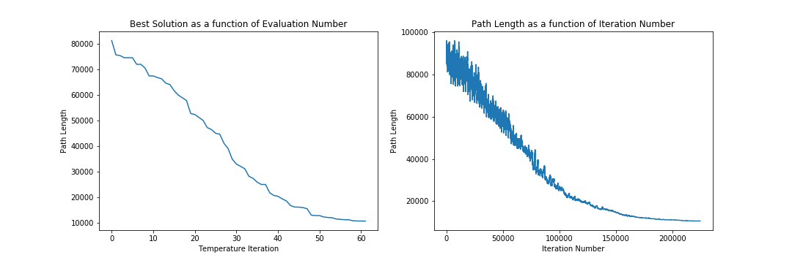
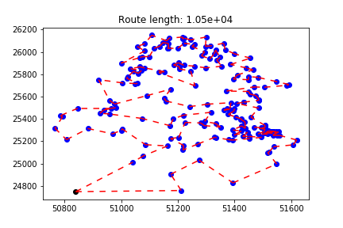

# TSP Qatar 194

Python Version : Python 3.7  
Libraries: numpy, pandas

## How To Run the code:
Helper functions as well as main program are all included in the Jupyter notebook TSP_Djibouti_38.ipynb  
City coordinates are read from the file Djibouti_38_coordinates.tsp located in ./data/

## Chosen Algorithm: Simulated Annealing
I have adapated the algorithm so as to make the parameter interpretation more intuitive. This helped me find the right parameters for convergence.

## Justification of the algorithm:  
Simulated annealing seemed like a reasonable choice since we are dealing with a combinatorial problem. Hyperparameter tuning is more intuitive to me for this algorithm than Genetic algorithms.  
An important aspect of the algorithm is the choice of perturbation of the solution. I implemented path rebranching as follows:
* given a path, pick 2 cities k1 and k2 at random.
* Keep the sequence from start to the city before k1.
* Then add the sequence between k1 and k2 in reverse order (starting from k2, and finishing with k1).
* Finally, add the sequence between cities k2 until the end.

## Parameters:

initial temperature: 5  
final temperature: 0.008  
cool factor: 0.9  
maximum number of iterations at given temperature: 1940 (10 times the number of cities)

## Final Results:

Solution:  
city: 0 	 x: 50840.0 	 y: 24748.3333  
city: 1 	 x: 51211.9444 	 y: 24758.8889  
city: 3 	 x: 51175.0 	 y: 24904.4444  
city: 6 	 x: 51275.2778 	 y: 25030.8333  
city: 2 	 x: 51394.7222 	 y: 24827.2222  
city: 4 	 x: 51548.8889 	 y: 24996.1111  
city: 8 	 x: 51516.6667 	 y: 25100.0  
city: 9 	 x: 51521.6667 	 y: 25103.3333  
city: 11 	 x: 51537.7778 	 y: 25150.8333  
city: 14 	 x: 51606.9444 	 y: 25167.7778  
city: 18 	 x: 51619.1667 	 y: 25211.3889  
city: 29 	 x: 51559.1667 	 y: 25252.5  
city: 31 	 x: 51549.7222 	 y: 25253.8889  
city: 30 	 x: 51535.2778 	 y: 25253.8889  
city: 41 	 x: 51547.7778 	 y: 25277.2222  
city: 49 	 x: 51555.2778 	 y: 25284.7222  
city: 34 	 x: 51545.2778 	 y: 25265.8333  
city: 43 	 x: 51541.3889 	 y: 25278.3333  
city: 48 	 x: 51546.6667 	 y: 25283.6111  
city: 54 	 x: 51546.6667 	 y: 25288.0556  
city: 51 	 x: 51534.1667 	 y: 25286.1111  
city: 45 	 x: 51535.0 	 y: 25281.1111  
city: 47 	 x: 51533.3333 	 y: 25283.3333  
city: 42 	 x: 51525.5556 	 y: 25278.3333  
city: 37 	 x: 51532.7778 	 y: 25270.5556  
city: 40 	 x: 51533.6111 	 y: 25275.8333  
city: 46 	 x: 51512.5 	 y: 25281.3889  
city: 57 	 x: 51520.8333 	 y: 25292.5  
city: 53 	 x: 51537.7778 	 y: 25287.5  
city: 55 	 x: 51528.3333 	 y: 25290.8333  
city: 52 	 x: 51533.3333 	 y: 25286.6667  
city: 39 	 x: 51523.0556 	 y: 25270.8333  
city: 38 	 x: 51505.8333 	 y: 25270.8333  
city: 33 	 x: 51516.3889 	 y: 25263.6111  
city: 36 	 x: 51483.3333 	 y: 25266.6667  
city: 50 	 x: 51504.1667 	 y: 25286.1111  
city: 60 	 x: 51507.7778 	 y: 25306.9444  
city: 67 	 x: 51470.0 	 y: 25325.2778  
city: 65 	 x: 51495.5556 	 y: 25320.5556  
city: 66 	 x: 51507.7778 	 y: 25322.5  
city: 72 	 x: 51507.5 	 y: 25341.9444  
city: 83 	 x: 51457.7778 	 y: 25416.9444  
city: 99 	 x: 51485.2778 	 y: 25497.5  
city: 104 	 x: 51408.3333 	 y: 25538.8889  
city: 106 	 x: 51431.9444 	 y: 25549.7222  
city: 107 	 x: 51433.3333 	 y: 25550.0  
city: 109 	 x: 51484.7222 	 y: 25566.9444  
city: 111 	 x: 51486.3889 	 y: 25574.7222  
city: 114 	 x: 51475.2778 	 y: 25610.2778  
city: 115 	 x: 51454.4444 	 y: 25622.5  
city: 116 	 x: 51450.0 	 y: 25645.8333  
city: 117 	 x: 51372.2222 	 y: 25650.0  
city: 120 	 x: 51468.8889 	 y: 25686.3889  
city: 119 	 x: 51505.8333 	 y: 25683.8889  
city: 122 	 x: 51584.7222 	 y: 25700.8333  
city: 123 	 x: 51591.6667 	 y: 25708.3333  
city: 127 	 x: 51547.5 	 y: 25734.7222  
city: 132 	 x: 51483.3333 	 y: 25772.2222  
city: 134 	 x: 51449.7222 	 y: 25779.1667  
city: 128 	 x: 51449.1667 	 y: 25751.1111  
city: 130 	 x: 51395.8333 	 y: 25758.3333  
city: 135 	 x: 51409.4444 	 y: 25793.3333  
city: 142 	 x: 51465.2778 	 y: 25839.1667  
city: 147 	 x: 51441.3889 	 y: 25857.5  
city: 154 	 x: 51386.3889 	 y: 25888.0556  
city: 159 	 x: 51456.3889 	 y: 25944.7222  
city: 165 	 x: 51400.0 	 y: 25983.3333  
city: 170 	 x: 51366.9444 	 y: 26021.6667  
city: 184 	 x: 51361.6667 	 y: 26078.0556  
city: 179 	 x: 51316.1111 	 y: 26055.0  
city: 177 	 x: 51297.5 	 y: 26050.2778  
city: 192 	 x: 51300.0 	 y: 26133.3333  
city: 187 	 x: 51244.7222 	 y: 26108.0556  
city: 190 	 x: 51222.7778 	 y: 26123.6111  
city: 188 	 x: 51216.6667 	 y: 26116.6667  
city: 191 	 x: 51216.6667 	 y: 26133.3333  
city: 189 	 x: 51169.1667 	 y: 26123.6111  
city: 186 	 x: 51161.1111 	 y: 26099.7222  
city: 193 	 x: 51108.0556 	 y: 26150.2778  
city: 181 	 x: 51083.6111 	 y: 26074.7222  
city: 175 	 x: 51056.9444 	 y: 26048.8889  
city: 168 	 x: 51083.6111 	 y: 26008.6111  
city: 155 	 x: 51000.0 	 y: 25900.0  
city: 160 	 x: 51066.6667 	 y: 25950.0  
city: 162 	 x: 51075.2778 	 y: 25957.7778  
city: 163 	 x: 51099.4444 	 y: 25958.3333  
city: 171 	 x: 51116.6667 	 y: 26033.3333  
city: 178 	 x: 51135.8333 	 y: 26050.5556  
city: 185 	 x: 51147.2222 	 y: 26083.6111  
city: 182 	 x: 51166.9444 	 y: 26076.6667  
city: 172 	 x: 51166.6667 	 y: 26033.3333  
city: 173 	 x: 51163.8889 	 y: 26033.6111  
city: 174 	 x: 51200.2778 	 y: 26033.6111  
city: 183 	 x: 51222.2222 	 y: 26077.2222  
city: 180 	 x: 51258.6111 	 y: 26067.2222  
city: 176 	 x: 51250.0 	 y: 26050.0  
city: 167 	 x: 51294.4444 	 y: 26000.2778  
city: 164 	 x: 51283.3333 	 y: 25966.6667  
city: 158 	 x: 51313.3333 	 y: 25937.5  
city: 166 	 x: 51328.0556 	 y: 25983.6111  
city: 169 	 x: 51333.3333 	 y: 26016.6667  
city: 161 	 x: 51349.7222 	 y: 25951.6667  
city: 157 	 x: 51337.5 	 y: 25928.3333  
city: 150 	 x: 51354.7222 	 y: 25871.9444  
city: 146 	 x: 51298.8889 	 y: 25857.5  
city: 151 	 x: 51258.3333 	 y: 25872.5  
city: 152 	 x: 51221.3889 	 y: 25880.8333  
city: 156 	 x: 51201.6667 	 y: 25904.1667  
city: 153 	 x: 51185.2778 	 y: 25883.0556  
city: 149 	 x: 51205.5556 	 y: 25867.7778  
city: 143 	 x: 51205.8333 	 y: 25847.7778  
city: 140 	 x: 51245.2778 	 y: 25829.7222  
city: 121 	 x: 51260.8333 	 y: 25696.1111  
city: 137 	 x: 51133.3333 	 y: 25816.6667  
city: 138 	 x: 51152.5 	 y: 25823.6111  
city: 145 	 x: 51083.3333 	 y: 25856.6667  
city: 148 	 x: 51066.6667 	 y: 25866.6667  
city: 144 	 x: 51033.3333 	 y: 25850.0  
city: 141 	 x: 51072.2222 	 y: 25833.3333  
city: 136 	 x: 51060.5556 	 y: 25808.3333  
city: 139 	 x: 51043.8889 	 y: 25826.6667  
city: 133 	 x: 51023.0556 	 y: 25775.8333  
city: 131 	 x: 51019.7222 	 y: 25765.2778  
city: 125 	 x: 51057.7778 	 y: 25717.5  
city: 124 	 x: 51050.0 	 y: 25716.6667  
city: 126 	 x: 51004.1667 	 y: 25723.0556  
city: 129 	 x: 50920.8333 	 y: 25751.9444  
city: 110 	 x: 50958.8889 	 y: 25567.5  
city: 103 	 x: 50977.2222 	 y: 25533.3333  
city: 113 	 x: 51092.2222 	 y: 25609.4444  
city: 118 	 x: 51174.4444 	 y: 25666.9444  
city: 112 	 x: 51151.3889 	 y: 25585.5556  
city: 108 	 x: 51158.6111 	 y: 25560.2778  
city: 101 	 x: 51242.2222 	 y: 25510.5556  
city: 102 	 x: 51304.4444 	 y: 25531.9444  
city: 105 	 x: 51387.5 	 y: 25545.8333  
city: 94 	 x: 51383.3333 	 y: 25483.3333  
city: 95 	 x: 51373.6111 	 y: 25490.5556  
city: 92 	 x: 51362.5 	 y: 25478.0556  
city: 96 	 x: 51400.2778 	 y: 25492.2222  
city: 91 	 x: 51397.5 	 y: 25469.7222  
city: 87 	 x: 51378.0556 	 y: 25440.8333  
city: 82 	 x: 51403.8889 	 y: 25416.9444  
city: 80 	 x: 51425.0 	 y: 25400.0  
city: 78 	 x: 51422.5 	 y: 25396.9444  
city: 76 	 x: 51436.6667 	 y: 25374.4444  
city: 63 	 x: 51438.6111 	 y: 25315.2778  
city: 69 	 x: 51425.0 	 y: 25337.5  
city: 59 	 x: 51394.4444 	 y: 25300.8333  
city: 56 	 x: 51424.4444 	 y: 25291.9444  
city: 32 	 x: 51398.8889 	 y: 25256.9444  
city: 44 	 x: 51445.5556 	 y: 25279.1667  
city: 27 	 x: 51428.8889 	 y: 25242.7778  
city: 28 	 x: 51452.5 	 y: 25243.0556  
city: 26 	 x: 51495.5556 	 y: 25235.5556  
city: 21 	 x: 51451.6667 	 y: 25223.3333  
city: 17 	 x: 51394.1667 	 y: 25210.8333  
city: 20 	 x: 51378.8889 	 y: 25214.4444  
city: 23 	 x: 51333.3333 	 y: 25233.3333  
city: 25 	 x: 51330.0 	 y: 25235.5556  
city: 16 	 x: 51269.4444 	 y: 25173.8889  
city: 10 	 x: 51218.3333 	 y: 25121.9444  
city: 13 	 x: 51220.8333 	 y: 25162.2222  
city: 22 	 x: 51174.4444 	 y: 25224.1667  
city: 24 	 x: 51203.0556 	 y: 25234.1667  
city: 75 	 x: 51226.3889 	 y: 25368.6111  
city: 74 	 x: 51281.1111 	 y: 25363.6111  
city: 71 	 x: 51293.6111 	 y: 25340.5556  
city: 68 	 x: 51350.2778 	 y: 25326.6667  
city: 73 	 x: 51333.6111 	 y: 25358.8889  
city: 77 	 x: 51294.7222 	 y: 25377.7778  
city: 90 	 x: 51316.6667 	 y: 25459.1667  
city: 86 	 x: 51220.0 	 y: 25433.3333  
city: 79 	 x: 51183.3333 	 y: 25400.0  
city: 70 	 x: 51173.3333 	 y: 25339.1667  
city: 81 	 x: 51073.0556 	 y: 25404.7222  
city: 88 	 x: 50958.3333 	 y: 25444.4444  
city: 89 	 x: 50925.0 	 y: 25451.3889  
city: 93 	 x: 50938.8889 	 y: 25480.5556  
city: 100 	 x: 50980.5556 	 y: 25500.8333  
city: 98 	 x: 50965.2778 	 y: 25495.0  
city: 97 	 x: 50846.6667 	 y: 25495.0  
city: 85 	 x: 50785.8333 	 y: 25429.7222  
city: 84 	 x: 50793.6111 	 y: 25419.4444  
city: 64 	 x: 50766.6667 	 y: 25316.6667  
city: 19 	 x: 50807.2222 	 y: 25214.1667  
city: 62 	 x: 50883.3333 	 y: 25313.8889  
city: 35 	 x: 50969.1667 	 y: 25266.6667  
city: 58 	 x: 51001.6667 	 y: 25298.6111  
city: 61 	 x: 51003.0556 	 y: 25311.9444  
city: 15 	 x: 51086.3889 	 y: 25168.8889  
city: 12 	 x: 51163.6111 	 y: 25158.3333  
city: 7 	 x: 51077.5 	 y: 25067.7778  
city: 5 	 x: 51039.4444 	 y: 25010.0    

Fitness: 10547 (known optimum 9352)  
Number of function evaluations: 224,466  
Stopping Criterion: Number of function evaluations  
Computational Time: 41.1 seconds  

Convergence curve:

Solution:  

