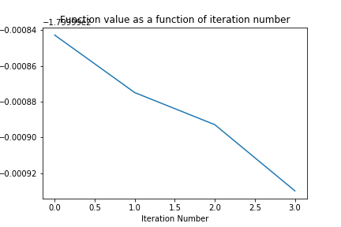

# Shifted Griewank

## How to run the code

The notebook is self contained:
* The function to optimise is implemented in the file functionToOptimise.py  
* Libraries needed: numpy, scipy

## Algorithm

I chose conjugate gradient as the function has a quadratic lead term.

## Dimension 50

### Parameters

Stopping criterion: || gradient || < tol, with tol=1e-6 and infinity norm.

### Results

Optimum found: -180 (known optimum -180)

number of function evaluations: 24

computational Time: 0.23 s

convergence curve

## Dimension 500

### Parameters

Stopping criterion: || gradient || < tol, with tol=1e-6 and infinity norm.

### Results

Optimum found: -180 (known optimum -180)

number of function evaluations: 27

computational Time: 9.89 s

convergence curve

