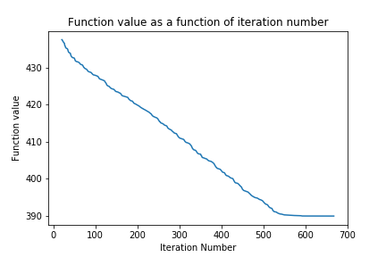
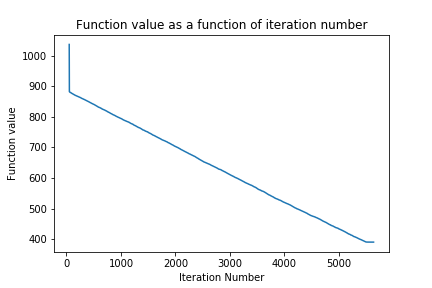

# Shifted Rosenbrock

## How to run the code

The notebook is self contained:
* The function to optimise is implemented in the file functionToOptimise.py  
* Libraries needed: numpy, scipy

## Algorithm

I chose conjugate gradient as the function is quadratic.

## Dimension 50

### Parameters

Stopping criterion: || gradient || < tol, with tol=1e-2 and infinity norm.

### Results

Optimum found: 390 (known optimum 390)

number of function evaluations: 67,569

computational Time: 0.69 s

convergence curve

Note: as initial function evaluations are very high, the following graph only displays values from iteration 20.  

## Dimension 500

### Parameters

Stopping criterion: || gradient || < tol, with tol=1e-2 and infinity norm.

### Results

Optimum found: 390.01 (known optimum 390)

number of function evaluations: 5,643,638

computational Time: 72.5 s

convergence curve

Note: as initial function evaluations are very high, the following graph only displays values from iteration 50.

### Calculating the number of function evaluations

The algorithm provides the number of iterations. The number of function evaluations is:  
(1 + 2 * dimension) * numberIterations  
since for each iteration and each dimension, gradient is numerically approximated.
