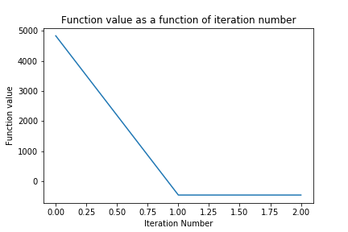
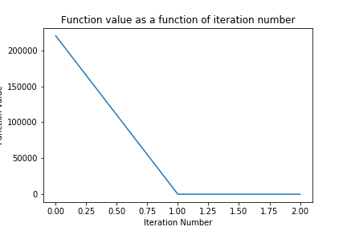

# Shifted Sphere

## How to run the code

The notebook is self contained:
* The function to optimise is implemented in the file functionToOptimise.py  
* Libraries needed: numpy, scipy

## Algorithm

I chose conjugate gradient as the function is quadratic.

## Dimension 50

### Parameters

Stopping criterion: || gradient || < tol, with tol=1e-6 and infinity norm.

### Results

Optimum found: -450 (known optimum -450)

number of function evaluations: 303

computational Time: 0.01 s

convergence curve

## Dimension 500

### Parameters

Stopping criterion: || gradient || < tol, with tol=1e-6 and infinity norm.

### Results

Optimum found: -449.99 (known optimum -450)

number of function evaluations: 3003

computational Time: 0.05 s

convergence curve

### Calculating the number of function evaluations

The algorithm provides the number of iterations. The number of function evaluations is:  
(1 + 2 * dimension) * numberIterations  
since for each iteration and each dimension, gradient is numerically approximated.
